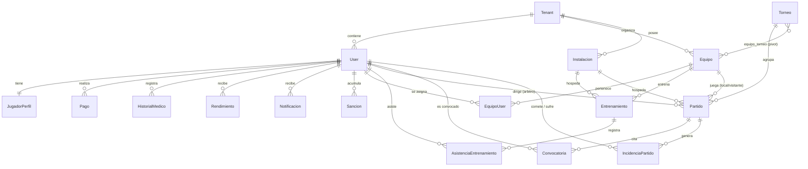
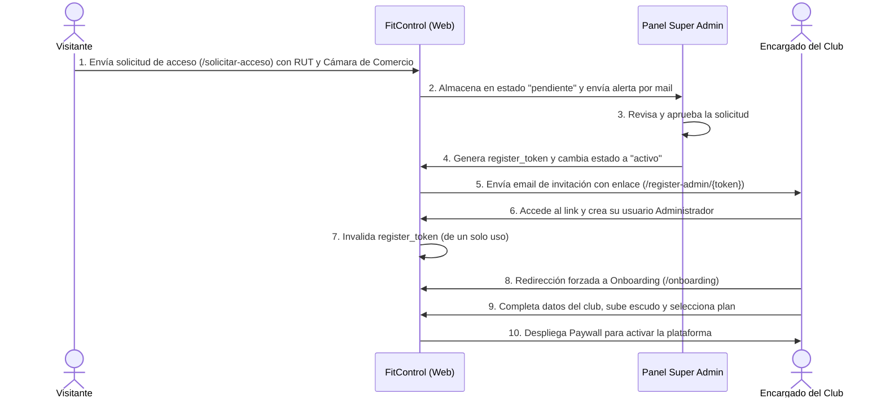

# 📘 Manual Técnico — FitControl SaaS
> **Plataforma SaaS Multi-Tenant para la Gestión de Clubes y Academias Deportivas**  
> **Versión:** 1.0.0  
> **Fecha:** 22 de Junio de 2026  
> **Tecnologías Core:** Laravel 12.0, Filament v4, React, Inertia.js v2.0, MySQL/PostgreSQL, Redis

---

## 📋 Tabla de Contenidos
1. [Introducción y Arquitectura General](#1-introducción-y-arquitectura-general)
2. [Arquitectura de Multi-Tenancy (Inquilinos)](#2-arquitectura-de-multi-tenancy-inquilinos)
3. [Estructura de Paneles y Autenticación (RBAC)](#3-estructura-de-paneles-y-autenticación-rbac)
4. [Modelo de Datos y Base de Datos (Con Diagrama Mermaid)](#4-modelo-de-datos-y-base-de-datos-con-diagrama-mermaid)
5. [Seguridad y Control de Suscripciones (Paywall Wompi & 2FA)](#5-seguridad-y-control-de-suscripciones-paywall-wompi--2fa)
6. [Flujos Técnicos Clave](#6-flujos-técnicos-clave)
7. [Jobs en Segundo Plano y Procesamiento Asíncrono](#7-jobs-en-segundo-plano-y-procesamiento-asíncrono)
8. [Estructura del Proyecto y Directorios](#8-estructura-del-proyecto-y-directorios)
9. [Instalación, Despliegue y Pruebas](#9-instalación-despliegue-y-pruebas)

---

## 1. Introducción y Arquitectura General

**FitControl** es una solución de software como servicio (SaaS) multi-tenant orientada a centralizar y optimizar las operaciones deportivas, administrativas, financieras y médicas de clubes y academias. La plataforma sigue el patrón **Single Database Multi-Tenancy** (Base de datos única con aislamiento lógico por columnas), lo cual simplifica los despliegues y migraciones del sistema, asegurando al mismo tiempo la estanqueidad de los datos.

### Stack Tecnológico
* **Backend:** Laravel 12.0 (PHP ^8.2 / 8.3)
* **Paneles de Control:** Filament v4.0 (Livewire v3 / Flux v2.9)
* **Frontend Público & Onboarding:** Inertia.js v2.0 + React 19 (empaquetado con Vite v7.0)
* **Base de Datos:** MySQL / PostgreSQL
* **Caché y Colas (Procesamiento asíncrono):** Redis (mediante Predis ^3.4)
* **Motor de Búsqueda:** Laravel Scout con soporte para Algolia y Meilisearch
* **Seguridad y Roles:** Spatie Permission y Filament Shield

```mermaid
graph TD
    Client[Cliente / Navegador] -->|Rutas Públicas / Inertia + React| PublicController[Páginas Públicas & Onboarding]
    Client -->|Rutas Admin / Livewire + Blade| FilamentPanels[Paneles Filament v4]
    
    subgraph Laravel Backend (v12)
        ResolveTenantBySubdomain[ResolveTenantBySubdomain Middleware]
        CheckTenantPayment[CheckTenantPayment Middleware]
        ApplyTenantColor[ApplyTenantColor Middleware]
        BelongsToTenant[Trait BelongsToTenant - Global Scope]
    end
    
    PublicController --> ResolveTenantBySubdomain
    FilamentPanels --> ResolveTenantBySubdomain
    ResolveTenantBySubdomain --> CheckTenantPayment
    CheckTenantPayment --> ApplyTenantColor
    ApplyTenantColor --> EloquentModels[Modelos Eloquent con Filtro Tenant]
    
    EloquentModels -->|Lectura / Escritura| DB[(Base de Datos Unificada)]
    EloquentModels -->|Caché / Colas| Redis[(Servidor Redis)]
```

---

## 2. Arquitectura de Multi-Tenancy (Inquilinos)

El aislamiento de inquilinos (Tenants) en FitControl se gestiona de forma lógica mediante tres componentes principales:

### A. Trait de Aislamiento Global: `BelongsToTenant`
Ubicado en `app/Models/Traits/BelongsToTenant.php`, este trait añade automáticamente un **filtro global** a todas las consultas de base de datos de las entidades del club:
* Si el usuario autenticado tiene el rol de `super_admin`, se omite el filtro y puede visualizar la información de todos los tenants.
* Para el resto de usuarios, el trait limita las consultas añadiendo:
  ```sql
  WHERE `tabla`.`tenant_id` = {tenant_id_del_usuario}
  ```
* Adicionalmente, al crear un registro, el trait captura el `tenant_id` del usuario autenticado y lo asigna de manera implícita si no ha sido provisto.

### B. Resolución de Inquilino mediante Subdominio: `ResolveTenantBySubdomain`
El middleware `ResolveTenantBySubdomain` inspecciona el host de cada petición:
1. Extrae el subdominio (ej: `millonarios` en `millonarios.fitcontrol.com` o `millonarios.localhost`).
2. Excluye subdominios reservados del sistema (`www`, `admin`, `localhost`, etc.).
3. Realiza la consulta de búsqueda sobre el modelo `Tenant` en el campo `subdominio`.
4. Para maximizar el rendimiento y evitar consultas redundantes a la base de datos, el resultado se almacena en la caché de Redis por **5 minutos** (`300` segundos) bajo la llave `tenant_subdomain_{subdominio}`.
5. Inyecta el modelo `Tenant` en los atributos de la petición `$request->attributes->set('tenant', $tenant)`.

### C. Personalización Dinámica de Estilos: `ApplyTenantColor`
El middleware `ApplyTenantColor.php` se encarga de leer el campo JSON `colores_oficiales` de la base de datos del inquilino (ej: `{"primary": "#1e3a8a"}`) y registrar dinámicamente dicha paleta en Filament a través de `FilamentColor::register` y `$panel->colors()`. Esto permite que la interfaz completa del panel Filament adopte el color representativo del club automáticamente tras iniciar sesión.

---

## 3. Estructura de Paneles y Autenticación (RBAC)

FitControl distribuye sus funcionalidades en **cinco paneles especializados** declarados como Providers en `app/Providers/Filament/`. Esto restringe el menú de navegación, widgets y recursos que cada usuario puede ver.

### Paneles de la Plataforma

| Panel | Ruta Base | Color Temático | Rol Asignado | Propósito Principal |
| :--- | :--- | :--- | :--- | :--- |
| **Admin** | `/admin` | Azul (`Color::Blue`) | `Administrador`, `super_admin` | Configuración del club, finanzas, onboarding, cobro de mensualidades y alta de personal. |
| **Entrenador** | `/entrenador` | Esmeralda (`Color::Emerald`) | `Entrenador` | Programación deportiva, planificación táctica, toma de asistencia e informes de rendimiento. |
| **Médico** | `/medico` | Teal / Cian | `Medico` | Control del historial de lesiones, estado de aptitud y tratamientos médicos. |
| **Árbitro** | `/arbitro` | Ámbar (`Color::Amber`) | `Arbitro` | Gestión de partidos asignados, programación y redacción de actas de novedades. |
| **Jugador** | `/jugador` | Rojo (`Color::Red`) | `Jugador` | Ficha técnica física, autogestión de perfil, visualización de entrenamientos, partidos e historial de pagos. |

### Control de Acceso Basado en Roles (RBAC)
* **Spatie Permission:** Los roles (`super_admin`, `Administrador`, `Entrenador`, `Jugador`, `Medico`, `Arbitro`) se definen y relacionan a nivel de base de datos en las tablas `roles` y `model_has_roles`.
* **Políticas (Laravel Policies):** Cada recurso de Filament cuenta con una política en `app/Policies` que restringe las acciones de lectura, creación, actualización y borrado de acuerdo con los permisos generados por **Filament Shield**.
* **Protección Anti Cross-Tenant (Seguridad de Sesiones):** Cuando ocurren eventos de creación o modificación de usuarios, roles o pertenencias a tenants, el sistema invoca de forma reactiva el método `User::clearUserInfoCache($userId)` para limpiar la caché de Redis (`user_info_{userId}` y `user_roles_{userId}`). Esto previene filtraciones de privilegios o sesiones obsoletas.

---

## 4. Modelo de Datos y Base de Datos (Con Diagrama Mermaid)

El dominio de FitControl se compone de las siguientes entidades mapeadas en `app/Models`:

1. **Tenant:** Centraliza la información del club (nombre, NIT, subdominio, escudo, colores, estado y plan de pago).
2. **User:** Registro de usuarios del sistema. Posee `tenant_id` y es el punto de entrada para todos los roles.
3. **Equipo:** Grupos del club clasificados por categoría (Profesional, Amateur, Formativo) y subcategoría (Sub-10 a Sub-18).
4. **EquipoUser (Pivot):** Relación histórica de jugadores/entrenadores asignados a los equipos deportivos.
5. **JugadorPerfil:** Extensión 1:1 de `User` (para jugadores). Almacena dorsal, posición de juego, peso, altura y pierna hábil.
6. **Entrenamiento:** Programación de prácticas y entrenamientos en instalaciones específicas.
7. **AsistenciaEntrenamiento:** Lista de asistencia de los jugadores a los entrenamientos (Presente/Ausente).
8. **Torneo:** Competición en la que participa uno o varios equipos del club (relacionados por `equipo_torneo`).
9. **Partido:** Planificación de partidos con rivales, localías, fases y arbitrajes asignados.
10. **Convocatoria:** Lista de jugadores citados para disputar un partido.
11. **IncidenciaPartido:** Eventos de juego (goles, autogoles, tarjetas amarillas/rojas, lesiones).
12. **Rendimiento:** Evaluaciones cuantitativas (0-10) del entrenador hacia el desempeño del jugador en entrenamientos o partidos.
13. **HistorialMedico:** Historial de lesiones o enfermedades, gravedad y estatus de aptitud para jugar.
14. **Sancion:** Registro de amonestaciones, multas o suspensiones aplicadas a los jugadores.
15. **Traspaso:** Historial de transferencias de jugadores entre equipos internos del club.
16. **Pago:** Registro de cuotas mensuales cobradas a jugadores.
17. **Instalacion:** Espacios físicos (canchas, gimnasios, piscinas) utilizables para entrenamientos y partidos.
18. **Notificacion:** Avisos y comunicaciones internas in-app dirigidas a usuarios del tenant.
19. **GeneratedReport:** Registro histórico de informes PDF o Excel generados de forma asíncrona.

### Diagrama de Relaciones de la Base de Datos



---

## 5. Seguridad y Control de Suscripciones (Paywall Wompi & 2FA)

La plataforma cuenta con un robusto sistema de seguridad y control financiero:

### A. Autenticación de Doble Factor (2FA - OTP)
El modelo `User` posee campos nativos de control de OTP (`two_factor_otp`, `two_factor_otp_expires_at`).
* Al iniciar sesión y tener habilitado el 2FA, se genera un código aleatorio criptográficamente seguro de 6 dígitos mediante `random_int(0, 999999)`.
* **Hash Bcrypt:** El código en texto plano se le envía al usuario por email (`TwoFactorCode` mailable), pero en la base de datos se guarda con hash `bcrypt` para máxima seguridad.
* **Expiración:** El código expira automáticamente a los **15 minutos**.
* El flujo es validado por el componente Livewire `App\Livewire\Auth\TwoFactorVerify`.

### B. Control del Paywall de Suscripción (Integración Wompi)
El acceso de los inquilinos está condicionado por su `estado_pago` (valores: `pendiente`, `pagado` o `rechazado`). El sistema controla esta restricción a través de dos mecanismos:

1. **Middleware `CheckTenantPayment` (Overlay Invasivo):**
   * En lugar de redirigir forzosamente y romper la navegación de Filament, si un club está en estado `pendiente`, el middleware intercepta la respuesta HTML de peticiones web estándar.
   * Inyecta antes del tag `</body>` un modal CSS (`paywall_overlay`) con efecto `backdrop-blur`. Esto bloquea visualmente las pantallas operativas mientras mantiene activas las rutas críticas de Logout, Paywall e invocaciones de red internas (Livewire/API).
2. **Ciclo de Pagos con Pasarela Wompi:**
   * **`PaywallController@prepare`:** Calcula el hash de firma (Signature SHA-256) requerido por Wompi usando la combinación de la referencia de pago única (`FC-{tenant_id}-{plan}-{timestamp}`), el monto en centavos de COP, la divisa (`COP`) y el `integrity_secret` configurado.
   * **Widget Checkout de Wompi:** Se incrusta en el paywall y procesa los pagos de forma segura.
   * **`PaywallController@callback` (Retorno Síncrono):** El usuario es redirigido a esta ruta tras completar la transacción. El controlador realiza una llamada HTTP segura a la API de Wompi (`v1/transactions/{id}`) para verificar el estado final (`APPROVED` o `PENDING`) y desbloquear la suscripción.
   * **`PaywallController@webhook` (Notificación Asíncrona):** Procesa webhooks del evento `transaction.updated` enviados por Wompi. Valida la firma del checksum comparando la concatenación de propiedades del payload y el `events_secret`. Si la firma es correcta, actualiza `estado_pago` a `pagado` y define el plan contratado (`mensual` o `anual`).

---

## 6. Flujos Técnicos Clave

### Flujo A: Solicitud de Acceso y Onboarding Multi-Tenant



### Flujo B: Toma de Asistencia Deportiva Directa
En el panel de entrenador, el control de asistencia está optimizado para su uso en tablets y dispositivos móviles en el campo de entrenamiento:
* Implementado en `AsistenciaEntrenamientoResource`.
* La columna de asistencia de los jugadores cuenta con un control de tipo **inline toggle** (cambio instantáneo).
* Al hacer click en el toggle, Livewire envía una petición AJAX asíncrona que actualiza la asistencia del jugador sin recargar la página, minimizando el consumo de datos móviles en campos de entrenamiento.

---

## 7. Jobs en Segundo Plano y Procesamiento Asíncrono

Para evitar demoras en los tiempos de respuesta HTTP del servidor, las tareas intensivas se ejecutan en colas utilizando Redis:

* **`SendBulkEmail`:** Encargado de enviar correos masivos del club a deportistas o entrenadores en segundo plano, evitando límites de timeout del servidor de correo.
* **`ProcessCsvImportJob`:** Módulo para la importación masiva de deportistas, entrenadores y registros mediante archivos CSV, procesando los registros por lotes e informando fallos.
* **Generación de Reportes Asíncronos (`ReportService`):**
  * Los reportes pesados de Filament (ej: históricos de rendimiento deportivo o exportación contable) se delegan al motor de colas.
  * El job genera el archivo Excel o PDF mediante librerías como `Maatwebsite Excel` y lo almacena de forma segura.
  * Registra la URL temporal en la tabla `generated_reports`, permitiendo la descarga posterior desde la ruta `/reportes/descargar/{report}` con previa validación de pertenencia al Tenant.

---

## 8. Estructura del Proyecto y Directorios

Ubicaciones clave del código fuente en el espacio de trabajo:

```text
├── app/
│   ├── Actions/                  # Acciones encapsuladas del sistema (Fortify, etc.)
│   ├── Filament/                 # Recursos, Páginas y Widgets de Filament v4
│   │   ├── Admin/                # Vistas y páginas del Panel de Administración
│   │   ├── Arbitro/              # Páginas y control del Panel del Árbitro
│   │   ├── Entrenador/           # Recursos y widgets del Panel de Entrenadores
│   │   ├── Jugador/              # Panel del deportista (fichas y rendimiento)
│   │   ├── Medico/               # Panel para el departamento de salud
│   │   └── Resources/            # CRUDs y componentes compartidos de Filament
│   ├── Http/
│   │   ├── Controllers/          # Controladores (Paywall, Onboarding, Reportes, Solicitudes)
│   │   └── Middleware/           # Filtros (ResolveTenantBySubdomain, CheckTenantPayment, ApplyTenantColor)
│   ├── Jobs/                     # Procesos en segundo plano (Imports, Emails en lote)
│   ├── Mail/                     # Plantillas y constructores de correos (Mails de aprobación, 2FA OTP)
│   ├── Models/                   # Entidades Eloquent del negocio (Tenant, User, Equipo, etc.)
│   │   └── Traits/               # Trait BelongsToTenant para filtrado lógico SaaS
│   ├── Providers/
│   │   └── Filament/             # Proveedores de Configuración de los 5 Paneles
│   └── Services/                 # Capas de Servicio (ApprovalService, ReportService)
├── bootstrap/
│   └── app.php                   # Registro y configuración del Pipeline de Middlewares
├── config/                       # Archivos de configuración general (services, database)
├── database/
│   ├── migrations/               # Esquema de base de datos e índices de rendimiento
│   └── seeders/                  # Llenado inicial de datos (Roles, Permisos, Usuarios de prueba)
├── resources/
│   ├── js/                       # Código frontend público (Inertia.js + React / Landing Page)
│   └── views/                    # Plantillas Blade (paywall, paywall_status, terminos)
├── routes/
│   ├── web.php                   # Rutas web públicas y privadas (Inertia, Paywall, Descargas)
│   └── api.php                   # Rutas API de integraciones (Webhooks de Wompi)
└── vite.config.js                # Configuración del empaquetador frontend Vite v7
```

---

## 9. Instalación, Despliegue y Pruebas

### A. Requisitos de Infraestructura
* **Servidor:** Docker con Docker Compose instalado.
* **PHP:** ^8.2 (en caso de instalación local tradicional).
* **Node.js:** v18+.
* **Base de Datos:** MySQL 8.0+ / PostgreSQL 15+.
* **Caché/Colas:** Redis Server 7.0+.

### B. Comandos de Inicialización (Local / Sail)
1. **Clonar e instalar dependencias:**
   ```bash
   git clone https://github.com/tu-organizacion/fitcontrol.git
   cd fitcontrol
   cp .env.example .env
   ```
2. **Levantar contenedores con Laravel Sail:**
   ```bash
   ./vendor/bin/sail up -d
   ```
3. **Generar claves y base de datos:**
   ```bash
   ./vendor/bin/sail composer install
   ./vendor/bin/sail php artisan key:generate
   ./vendor/bin/sail php artisan migrate --seed
   ./vendor/bin/sail npm install
   ./vendor/bin/sail npm run build
   ```
4. **Comando de Desarrollo Unificado (Sin Sail):**
   Si se cuenta con entorno nativo PHP/Node:
   ```bash
   composer dev
   ```
   *Este comando utiliza `concurrently` para lanzar en paralelo el servidor web local (`php artisan serve`), el procesamiento de colas (`php artisan queue:listen`), el compilador frontend (`npm run dev`) y los logs dinámicos (`php artisan pail`).*

### C. Ejecución de Pruebas Automatizadas
Para verificar que los filtros de multi-tenancy, autenticación 2FA y validaciones de pago funcionan adecuadamente:
```bash
# Con Docker Sail
./vendor/bin/sail php artisan test

# Entorno local directo
php artisan test
```

---
> **FitControl SaaS** — Diseñado para el alto rendimiento administrativo y deportivo. Todos los derechos reservados.
