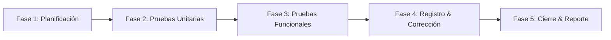

# 🧪 Plan de Pruebas de Software — FitControl SaaS
> **Plataforma SaaS Multi-Tenant para la Gestión de Clubes y Academias Deportivas**  
> **Versión:** 1.0.0  
> **Fecha:** 22 de Junio de 2026  
> **Estándares Aplicados:** Basado en el Estándar IEEE 829 / ISO/IEC/IEEE 29119 (Documentación de Pruebas)

---

## 📖 Tabla de Contenidos
1. [Alcance del Plan de Pruebas](#1-alcance-del-plan-de-pruebas)
2. [Objetivos de las Pruebas](#2-objetivos-de-las-pruebas)
3. [Estrategia de Pruebas](#3-estrategia-de-pruebas)
4. [Recursos (Hardware, Software y Humanos)](#4-recursos-hardware-software-y-humanos)
5. [Procedimientos de Prueba](#5-procedimientos-de-prueba)
6. [Criterios de Validación (Aprobación y Suspensión)](#6-criterios-de-validación-aprobación-y-suspensión)
7. [Referencias](#7-referencias)

---

## 1. Alcance del Plan de Pruebas

El presente **Plan de Pruebas** detalla las actividades de aseguramiento de calidad (QA) aplicadas a la plataforma **FitControl SaaS**. Define los módulos, componentes y flujos de negocio que serán verificados sistemáticamente antes del lanzamiento oficial del sistema.

### A. Elementos Dentro del Alcance (In Scope)
* **Arquitectura Multi-Tenant:** Validación de la estanqueidad de datos y del filtro global `BelongsToTenant`.
* **Paneles de Control:** Pruebas funcionales de los 5 paneles de Filament v4 (Administrador, Entrenador, Médico, Árbitro y Jugador).
* **Flujos de Seguridad:** Verificación de la autenticación 2FA (OTP) y la asignación de roles mediante Spatie/Shield.
* **Módulo de Finanzas (Paywall Wompi):** Pruebas de integración de la simulación de pagos, callback de confirmación y procesamiento de webhooks.
* **Procesamientos Asíncronos:** Validación del encolamiento de tareas en Redis (envío masivo de correos, generación de reportes e importación de CSVs).

### B. Elementos Fuera del Alcance (Out of Scope)
* Estabilidad y latencia de la red de conexión de los usuarios finales.
* Disponibilidad interna de los servidores de la pasarela de pagos de Wompi.
* Escalabilidad del hardware del servidor de hosting bajo condiciones de carga extrema (fuera de las pruebas funcionales).

---

## 2. Objetivos de las Pruebas

El objetivo general es garantizar que FitControl SaaS opere bajo altos estándares de confiabilidad, seguridad y usabilidad.

### Objetivos Específicos
* **Confiabilidad:** Lograr un 100% de ejecuciones exitosas en la suite de pruebas unitarias (`php artisan test`).
* **Seguridad:** Confirmar que ningún usuario de un club (Tenant A) pueda acceder, consultar o modificar datos pertenecientes a otro club (Tenant B) bajo ningún caso.
* **Integridad:** Garantizar que el bloqueo visual por falta de pago (Overlay Paywall) se despliegue de forma correcta para todos los recursos del panel cuando el estado de suscripción sea `pendiente`.
* **Calidad de Código:** Verificar que el sistema no contenga defectos críticos o bloqueantes abiertos al momento de la entrega.

---

## 3. Estrategia de Pruebas

Para maximizar la cobertura del código y evaluar el software desde múltiples perspectivas, se aplicará una estrategia de pruebas multinivel:

### A. Pruebas Unitarias y de Integración (Caja Blanca)
* **Herramienta:** PHPUnit v11.5.
* **Propósito:** Validar de forma automatizada las reglas de negocio individuales de los modelos Eloquent, los scopes de consulta de tenants, políticas de autorización de Laravel y la lógica interna de los middlewares de control.

### B. Pruebas Funcionales (Caja Negra)
* **Método:** Ejecución manual paso a paso guiada por los Casos de Prueba de Aceptación (CPA).
* **Propósito:** Evaluar la usabilidad de la interfaz de Filament, la persistencia de datos en los CRUDs, el comportamiento interactivo del toggle rápido de asistencia de entrenamientos y el flujo del paywall Wompi.

### C. Pruebas de Regresión
* **Método:** Ejecución automatizada de la suite completa tras cada modificación o integración de nuevos módulos.
* **Propósito:** Garantizar que los parches de código aplicados no alteren ni afecten negativamente a las funcionalidades previamente validadas.

### D. Pruebas de Seguridad y Autorización
* **Método:** Simulación de ataques de elevación de privilegios y bypass de URL.
* **Propósito:** Comprobar la efectividad del RBAC (Spatie) y que la caché de seguridad de roles de usuario se limpie reactivamente al actualizar un perfil.

---

## 4. Recursos (Hardware, Software y Humanos)

### A. Recursos de Hardware
* Estaciones de trabajo del equipo de QA (procesador Quad-Core, 8 GB de RAM).
* Servidor de pruebas de preproducción (Staging Cloud) con configuración similar al productivo.

### B. Recursos de Software
* **Virtualización:** Docker & Docker Compose (Laravel Sail).
* **Base de Datos:** MySQL / PostgreSQL y Redis Server.
* **Control de Versiones:** Git y Repositorio GitHub.
* **Framework de Pruebas:** PHPUnit.

### C. Recursos Humanos
* **Analista de QA (Tester):** Responsable de diseñar y ejecutar los casos de prueba y reportar incidencias.
* **Líder de QA / Scrum Master:** Coordina las fases de pruebas y valida los criterios de salida.
* **Líder de Desarrollo (Developer):** Encargado de corregir los defectos identificados en el código.
* **Product Owner / Cliente:** Valida la conformidad en el periodo de aceptación.

---

## 5. Procedimientos de Prueba

Las actividades de prueba se llevarán a cabo en cinco fases secuenciales:

1. **Fase 1: Planificación y Configuración:** Preparar el entorno de staging, migrar la base de datos limpia y poblarla con los seeders iniciales de roles y permisos.
2. **Fase 2: Ejecución de Pruebas Unitarias:** Ejecución automática de la suite de PHPUnit para validar la lógica pura del backend.
3. **Fase 3: Ejecución de Pruebas Funcionales:** Ejecución manual de los escenarios críticos definidos (Onboarding, Autenticación, Cobros, Control Deportivo).
4. **Fase 4: Registro y Corrección de Defectos:** Documentación de fallas encontradas en el gestor de incidentes. El equipo de desarrollo corrige el código y el equipo de QA realiza el re-test de la funcionalidad.
5. **Fase 5: Cierre y Reporte:** Elaboración del informe de cierre de pruebas detallando la cobertura y el estado de los incidentes detectados.

---

## 6. Criterios de Validación (Aprobación y Suspensión)

### A. Criterios de Suspensión de Pruebas
Las actividades de prueba se suspenderán de forma inmediata si se presenta alguno de los siguientes escenarios:
* El servidor de base de datos o de caché Redis experimenta caídas continuas que impiden la navegación.
* Se identifica una falla crítica en el flujo de inicio de sesión (Login) que bloquea el ingreso a los paneles.
* Se detecta que el aislamiento multi-tenant no está operando (fuga de datos entre inquilinos), comprometiendo la seguridad de la información.

Las pruebas se reanudarán una vez que el equipo de desarrollo provea un parche correctivo estable.

### B. Criterios de Aprobación (Pase a Producción)
Para considerar la suite de pruebas como aprobada y autorizar la liberación del software a producción, se deben cumplir los siguientes parámetros cuantitativos:

| Métrica / Parámetro | Valor Requerido | Método de Verificación |
|:---|:---:|:---|
| **Éxito de Pruebas Unitarias** | 100% | Ejecución limpia del comando `php artisan test`. |
| **Cobertura de Casos de Aceptación** | 100% | Ejecución conforme de todos los CPA del manual de aceptación. |
| **Defectos Críticos Abiertos** | 0 | Reporte de incidencias en estado de resolución 'Cerrado'. |
| **Defectos de Severidad Media Abiertos** | $\le 2$ | Documentados con plan de Hotfix programado para post-lanzamiento. |

---

## 7. Referencias

* **IEEE Std 829-2008.** *IEEE Standard for Software and System Test Documentation*. IEEE.
* **ISO/IEC/IEEE 29119-2:2021.** *Software and systems engineering — Software testing — Part 2: Test processes*. ISO.
* **PHPUnit Contributors. (2026).** *PHPUnit Manual (Version 11.5)*. https://phpunit.de/manual.html
* **Laravel Framework 12.x.** *Testing and Quality Assurance Guides*. https://laravel.com/docs/12.x/testing
